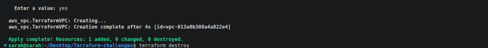

# Challenge 1 — Deploy a VPC with Terraform

Create an AWS VPC using Terraform from scratch.

## What You'll Build

- A VPC with CIDR block `192.168.0.0/24` in `eu-north-1`

## Prerequisites

- Terraform installed (`>= 1.0.0`)
- AWS CLI configured with valid credentials


## Steps

### 1. Create `main.tf`

```hcl
provider "aws" {
  region = "eu-north-1"
}

resource "aws_vpc" "TerraformVPC" {
  cidr_block = "192.168.0.0/24"

  tags = {
    Name = "TerraformVPC"
  }
}
```


### 2. Initialize Terraform

```bash
terraform init
```


### 3. Preview the Plan

```bash
terraform plan
```


### 4. Apply the Configuration

```bash
terraform apply
```

Type `yes` when prompted.



### 5. Verify in AWS Console

Navigate to **VPC → Your VPCs** and confirm `TerraformVPC` is listed.


### 6. Destroy the Resources

```bash
terraform destroy
```

Type `yes` when prompted.


## Resources Created

| Resource | Name | CIDR |
|---|---|---|
| AWS VPC | TerraformVPC | 192.168.0.0/24 |
